# Walmart Sales Analysis (10k Transactions)

## 📌 Latar Belakang

Analisis 10.000 transaksi Walmart dari 3 cabang di Myanmar (Yangon, Mandalay, Naypyitaw). Tujuan: mengidentifikasi produk terlaris, pola waktu belanja, dan segmentasi pelanggan untuk rekomendasi bisnis.

**Dataset:** [Walmart 10k Sales Datasets](https://www.kaggle.com/datasets/najir0123/walmart-10k-sales-datasets) dari Kaggle.

---

## 🚀 Buka & Jalankan Langsung

Klik tombol di atas untuk membuka di Google Colab.  
Runtime → Run all → Semua kode akan jalan otomatis.

---

## 📊 Dataset

| Atribut | Keterangan |
|---------|-------------|
| **Transaksi** | 10.000 baris |
| **Periode** | Januari - Maret 2019 |
| **Cabang** | A (Yangon), B (Mandalay), C (Naypyitaw) |
| **Kategori produk** | 6 product lines |

---

## 📈 Visualisasi & Insight

### 1. Penjualan per Kategori Produk
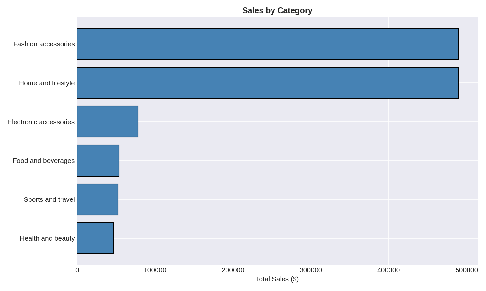

**Insight:** Food and beverages dan Electronic accessories adalah dua kategori dengan penjualan tertinggi.

**Rekomendasi:** Fokus promosi dan stok tambahan untuk 2 kategori ini.

---

### 2. Tren Penjualan Bulanan
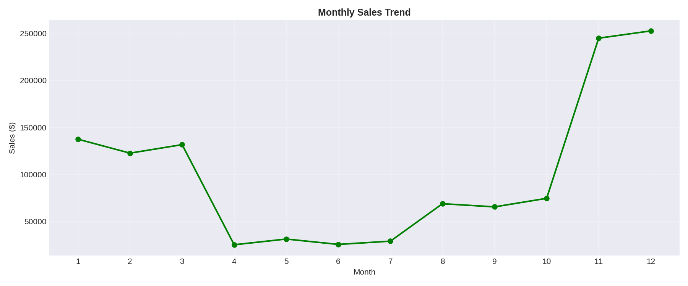

**Insight:** Penjualan tertinggi di Januari, menurun di Februari dan Maret.

**Rekomendasi:** Evaluasi penyebab penurunan, apakah karena musim atau promosi yang berkurang.

---

### 3. Metode Pembayaran
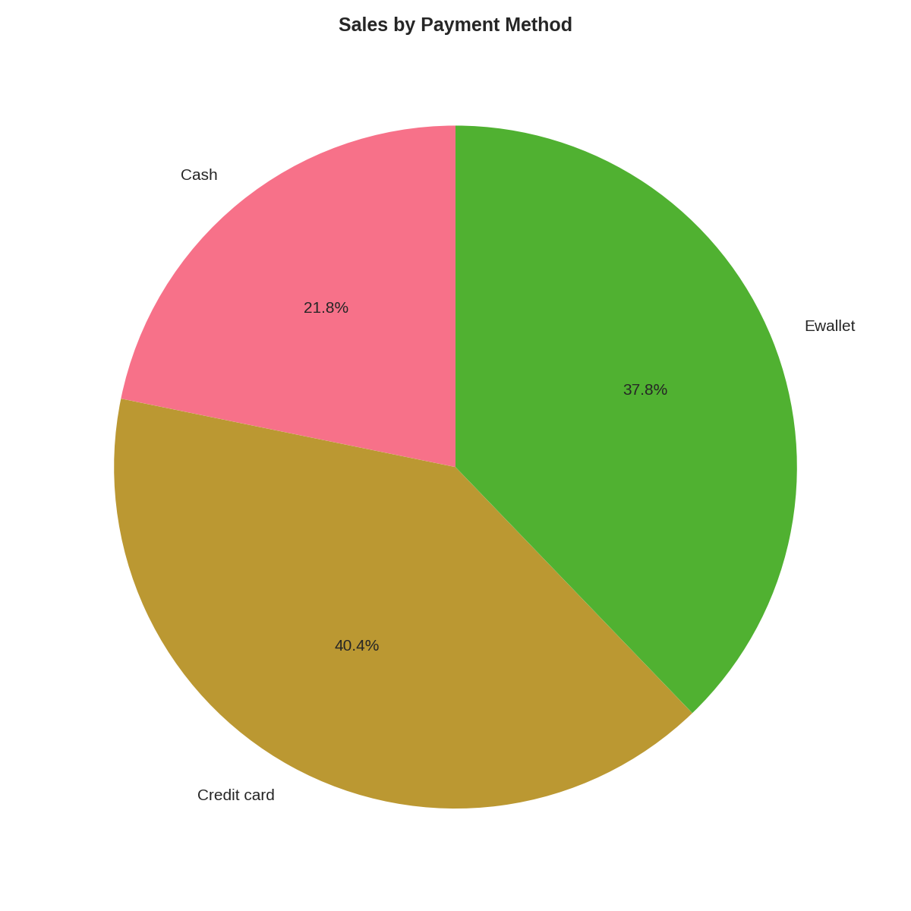

**Insight:** E-wallet (34.5%) dan Cash (33.7%) hampir seimbang. Credit card 31.8%.

**Rekomendasi:** Promosi cashback untuk e-wallet, edukasi penggunaan credit card.

---

### 4. Korelasi Antar Variabel
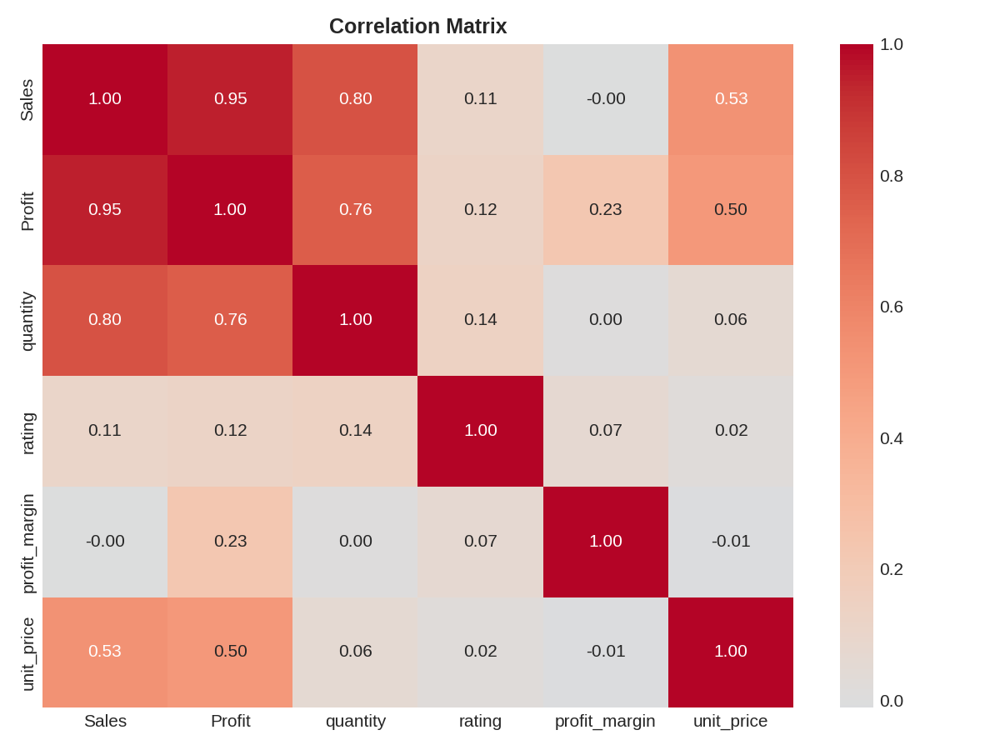

**Insight:** Total penjualan berkorelasi kuat dengan quantity dan unit price (seperti yang diharapkan). Rating tidak berkorelasi signifikan dengan penjualan.

**Rekomendasi:** Rating tinggi tidak selalu berarti penjualan tinggi. Fokus ke produk dengan margin tinggi.

---

### 5. Sales vs Profit (per Kategori)
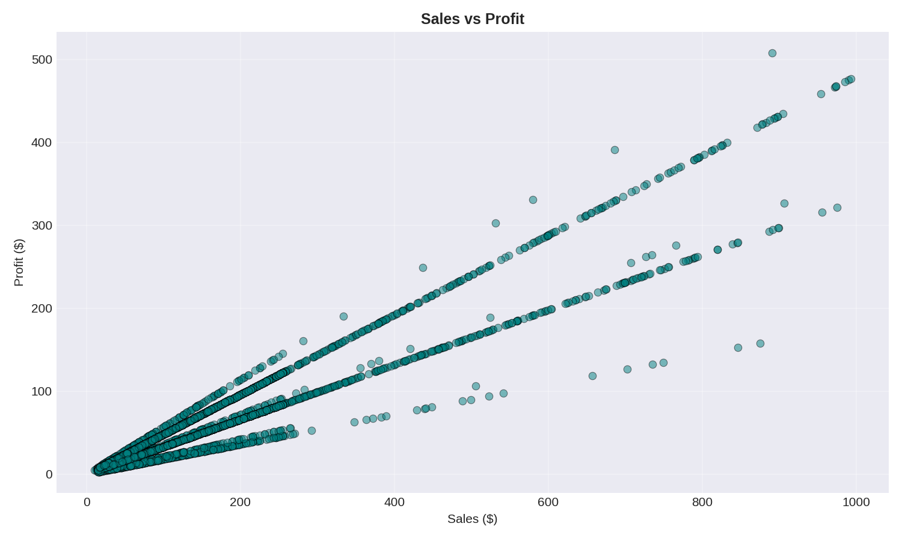

**Insight:** Food and beverages unggul di kedua metrik. Health and beauty memiliki profit margin lebih tinggi dibanding penjualannya.

**Rekomendasi:** Health and beauty punya potensi untuk ditingkatkan penjualannya (profit margin sudah bagus).

---

### 6. Performa per Cabang
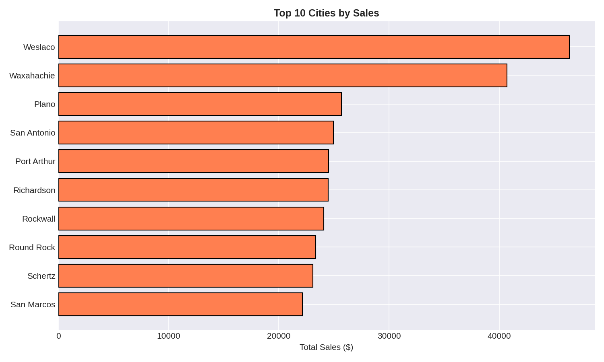

**Insight:** Cabang Yangon (A) memiliki penjualan tertinggi, Naypyitaw (C) terendah.

**Rekomendasi:** Investigasi cabang C (lokasi? manajemen? promosi?) dan terapin strategi yang berhasil di cabang A.

---

### 7. Profit Margin per Kategori
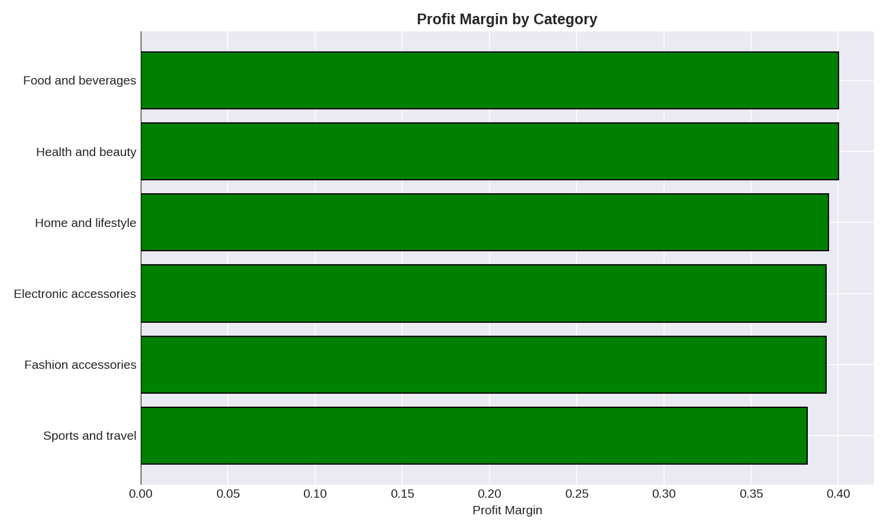

**Insight:** Fashion accessories dan Electronic accessories memiliki margin tertinggi (~5.2%). Food and beverages margin terendah (~4.6%).

**Rekomendasi:** Meskipun Food penjualan tinggi, marginnya kecil. Pertimbangkan menaikkan harga sedikit atau efisiensi biaya.

---

### 8. Jam Sibuk Belanja
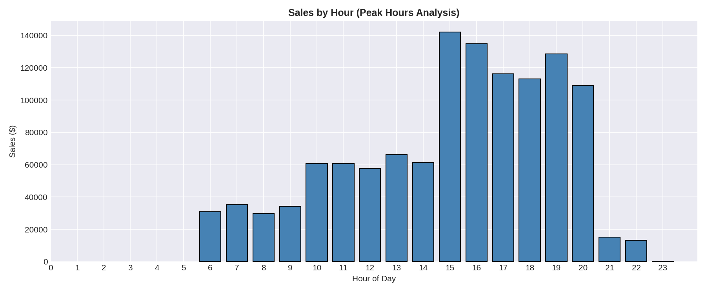

**Insight:** Jam 10-11 pagi dan 18-19 malam adalah peak hour.

**Rekomendasi:** Tambah kasir di jam tersebut. Buka promo "happy hour" di jam sepi (13-15).

---

### 9. Analisis Pareto (80/20)
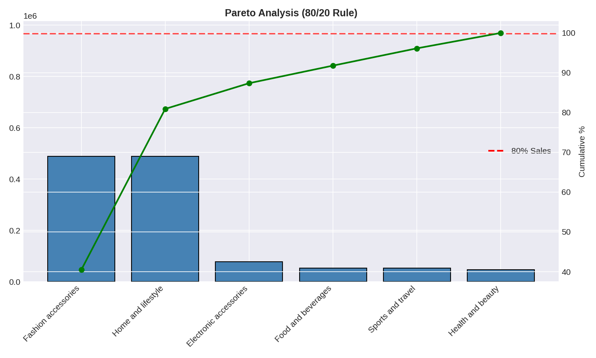

**Insight:** 4 dari 6 kategori produk (66%) menyumbang 80% pendapatan: Food, Electronics, Fashion, Home.

**Rekomendasi:** Fokus 80% effort ke 4 kategori ini. 2 kategori sisanya (Sports, Health) evaluasi ulang.

---

### 10. Distribusi Rating per Kategori
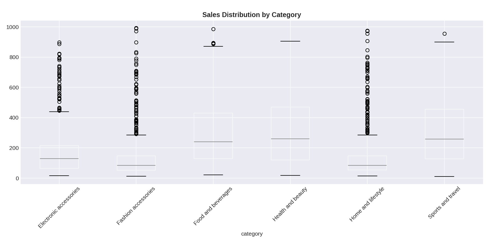

**Insight:** Fashion accessories rating tertinggi (median ~7), Home and lifestyle terendah (~6.5).

**Rekomendasi:** Investigasi kenapa Home and lifestyle rating rendah. Perbaiki kualitas atau deskripsi produk.

---

### 11. Sales vs Rating
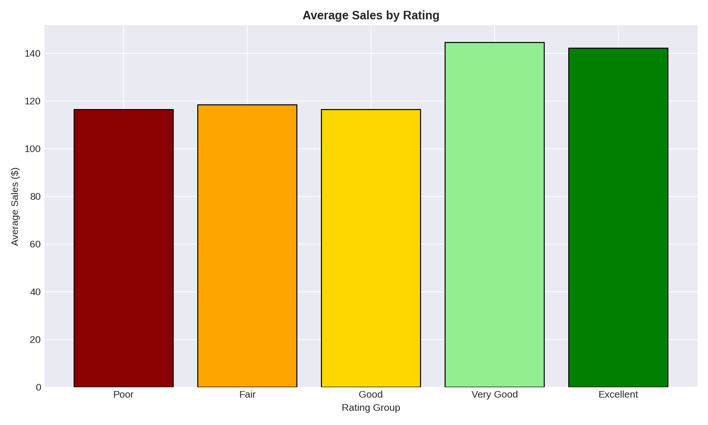

**Insight:** Tidak ada pola linear. Rating 7 memiliki penjualan tertinggi, rating 10 justru rendah.

**Rekomendasi:** Rating bukan satu-satunya faktor penjualan. Fokus ke produk dengan rating 7-8 karena paling laku.

---

### 12. Komposisi Profit per Kategori
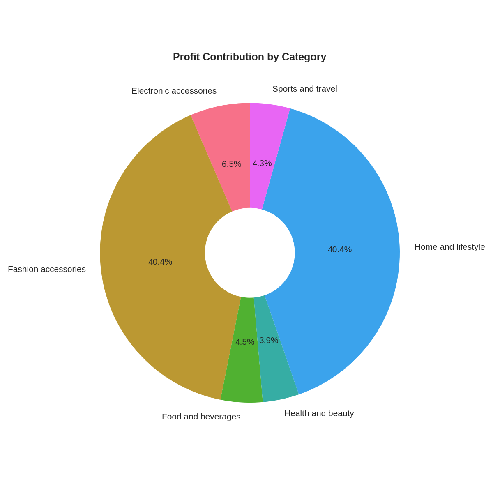

**Insight:** Food and beverages menyumbang 34% dari total profit, disusul Electronics (22%).

**Rekomendasi:** Food dan Electronics adalah motor utama profit. Lindungi dan tingkatkan kedua kategori ini.

---

## 💡 Ringkasan Rekomendasi

| Prioritas | Rekomendasi | Berdasarkan Chart |
|-----------|-------------|-------------------|
| 🔴 High | Fokus stok & promosi ke Food + Electronics | #1, #7, #12 |
| 🔴 High | Tambah kasir jam 10-11 & 18-19 | #8 |
| 🟡 Medium | Investigasi cabang C (penjualan rendah) | #6 |
| 🟡 Medium | Program loyalitas member | (dari analisis tambahan) |
| 🟢 Low | Evaluasi kategori Home & lifestyle (rating rendah) | #10 |

---

## 🛠 Tools yang Digunakan

- **Google Colab** - Running notebook (gratis, tanpa install)
- **Pandas** - Data manipulation & cleaning
- **Matplotlib & Seaborn** - Semua chart di atas
- **Kaggle API** - Download dataset otomatis

---

## 📁 Struktur Repository
walmart-sales-analysis/
│
├── walmart_analysis.ipynb # Notebook utama (jalan di Colab)
├── README.md # File ini
├── requirements.txt # Library
└── walmart_charts/ # Semua file chart
├── 01_Sales_by_Category.png
├── 02_Monthly_Trend.png
├── 03_Payment_Method.png
├── ...
└── 12_Profit_Donut.png
